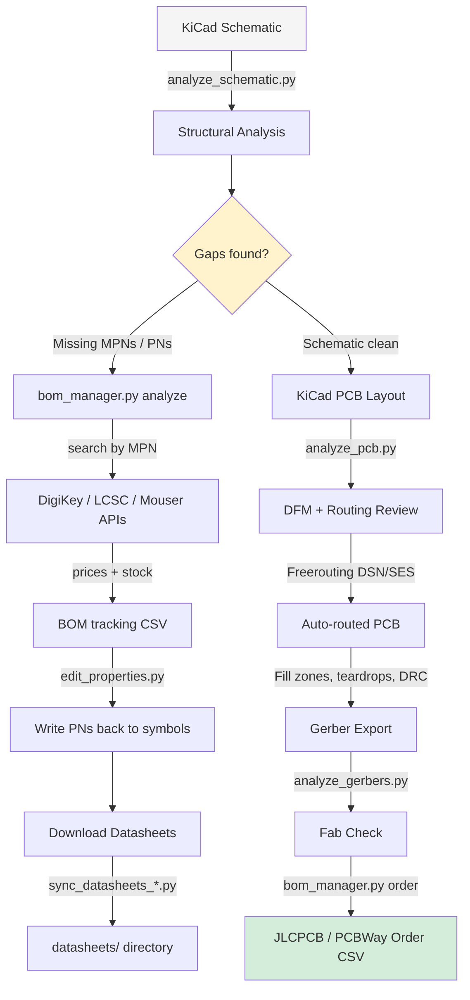
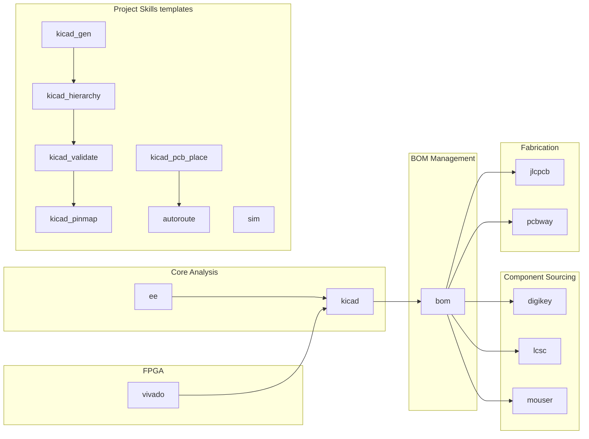

# kicad-automations — Claude Code Skills for EDA

Production-grade Claude Code skills for KiCad schematic + PCB design, BOM management, component sourcing, fabrication, FPGA integration, and electrical engineering reference.

Battle-tested on complex multi-layer RF PCBs: 6-layer designs with BGAs, multi-distributor BOM pipelines, and full pre-fab simulation chains.

---

## Design Flow



---

## Skill Map



---

## Worked Example — Buck Converter Board

A complete 5V → 3.3V buck converter, built with these skills end-to-end.

**Circuit:** TPS62130 adjustable buck — feedback resistor divider sets Vout, 10µH inductor, MLCC input/output caps.

### Step 1 — Analyze the Schematic

```bash
python3 skills/kicad/scripts/analyze_schematic.py buck.kicad_sch --output buck_analysis.json
```

Sample output (signal_analysis):
```json
{
  "power_regulators": [{
    "reference": "U1",
    "topology": "buck",
    "vout_estimated": 3.3,
    "vref_source": "lookup",
    "output_net": "VCC_3V3",
    "vout_net_mismatch": false,
    "feedback_r_top": "R1",
    "feedback_r_bottom": "R2"
  }],
  "rc_filters": [{
    "reference": "C3",
    "cutoff_hz": 723000,
    "type": "low_pass"
  }]
}
```

The analyzer finds: regulator topology, estimated Vout (via ~60-family Vref lookup), feedback network, decoupling gaps, missing PWR_FLAGs.

### Step 2 — Find Missing Parts

```bash
python3 skills/bom/scripts/bom_manager.py analyze buck.kicad_sch --json
```

Flags:
- `U1`: MPN set (`TPS62130ARGTR`), no DigiKey PN
- `L1`: value `10uH` — generic, needs MPN and LCSC PN for JLCPCB
- `C1,C2`: `10uF 16V X7R 0805` — needs sourcing

### Step 3 — Source Parts + Download Datasheets

```bash
# Download all datasheets via DigiKey API
python3 skills/digikey/scripts/sync_datasheets_digikey.py buck.kicad_sch
# -> datasheets/TPS62130ARGTR.pdf  (Texas Instruments, 2.4MB)
# -> datasheets/SRR6028-100Y.pdf   (Bourns, 1.1MB)

# Write DigiKey PNs back to schematic symbols
echo '{"U1": {"DigiKey": "296-TPS62130ARGTR-ND", "Manufacturer": "Texas Instruments"},
      "L1": {"MPN": "SRR6028-100Y", "LCSC": "C408337"}}' \
  | python3 skills/bom/scripts/edit_properties.py buck.kicad_sch
```

### Step 4 — Export BOM + Generate Order Files

```bash
python3 skills/bom/scripts/bom_manager.py export buck.kicad_sch -o bom/bom.csv
python3 skills/bom/scripts/bom_manager.py order bom/bom.csv --boards 3 --spares 2
# -> bom/orders/digikey_order.csv   (U1, passives)
# -> bom/orders/lcsc_order.csv      (L1, MLCC caps)
```

### Step 5 — PCB Analysis

```bash
python3 skills/kicad/scripts/analyze_pcb.py buck.kicad_pcb
```

Catches: power trace too narrow for 2A (needs 0.5mm min per IPC-2221), thermal pad under U1 has 0 vias (should have 4+), C1 decoupling cap 3.2mm from VIN pin (should be <1mm).

### Step 6 — Autoroute

```bash
# In KiCad: File -> Export -> Specctra DSN -> buck.dsn
# Manual first: route feedback resistors to FB pin, decoupling caps to VIN/VOUT
java -jar freerouting.jar -de buck.dsn -do buck.ses -mp 100
# In KiCad: File -> Import -> Specctra Session -> buck.ses
# Then: Edit -> Fill All Zones (B)
```

---

## What's in This Repo

```
skills/                        Global skills -> install to ~/.claude/skills/
  kicad/                       Schematic, PCB, Gerber analyzers + 12 reference docs
  bom/                         BOM lifecycle: analyze, enrich, export, order
  digikey/                     DigiKey OAuth2 API: part search + datasheet sync
  lcsc/                        LCSC via jlcsearch: production sourcing, no key needed
  mouser/                      Mouser Search API: secondary prototype sourcing
  jlcpcb/                      JLCPCB Partner API: PCB quoting + assembly ordering
  pcbway/                      PCBWay: alternative fab + turnkey assembly
  ee/                          EE reference: circuits, power supply, RF, thermal, EMC
  vivado/                      Vivado FPGA build, ADI HDL, Zynq PS7/MPSoC block design

project-skills/                Templates -> copy to .claude/skills/ and customize
  kicad_gen/                   Programmatic schematic generation (BGA/QFN pin maps)
  kicad_hierarchy/             Root schematic management across sub-sheets
  kicad_validate/              Cross-reference audit: spec vs schematic vs BOM vs layout
  kicad_pinmap/                IC pin-to-net mapping auditor and gap filler
  kicad_pcb_place/             Constraint-driven placement + pcbnew scripting API
  autoroute/                   Freerouting integration + post-route cleanup checklist
  sim/                         RF chain (scikit-rf), power (LTspice), PCB EM (openEMS)
```

---

## Current Gaps / Roadmap

| Skill | Status | Notes |
|-|-|-|
| `element14` | Planned | Newark / Farnell / element14 API — EU + international sourcing |
| `openscad` | Planned | Parametric enclosures and mounting hardware for PCB housings |
| `drc_rules` | Planned | KiCad DRU authoring skill for JLCPCB / PCBWay / custom fabs |
| `ci` | Planned | KiBot-based CI pipeline — DRC, ERC, Gerber, BOM in GitHub Actions |
| `signal_integrity` | Planned | Dedicated SI skill — stackup design, impedance calc, eye diagrams |

---

## Quick Install

```bash
git clone https://github.com/mattpainter701/kicad_automations.git
cd kicad_automations

# Install all global skills to ~/.claude/skills/
./install.sh

# Also install project-skill templates into your project
./install.sh --project-skills-dir .claude/skills
```

Add to your project's `CLAUDE.md`:

```markdown
## Skills
- **KiCad:** @~/.claude/skills/kicad/SKILL.md
- **BOM:** @~/.claude/skills/bom/SKILL.md
- **DigiKey:** @~/.claude/skills/digikey/SKILL.md
- **LCSC:** @~/.claude/skills/lcsc/SKILL.md
- **Mouser:** @~/.claude/skills/mouser/SKILL.md
- **JLCPCB:** @~/.claude/skills/jlcpcb/SKILL.md
- **PCBWay:** @~/.claude/skills/pcbway/SKILL.md
- **EE:** @~/.claude/skills/ee/SKILL.md
- **Vivado:** @~/.claude/skills/vivado/SKILL.md
```

---

## Analyzer Scripts — Capability Reference

### `analyze_schematic.py`

| Category | What It Detects |
|-|-|
| Components | Reference, value, footprint, lib_id, MPN, datasheet, DNP |
| Regulators | LDO / buck / boost topology, Vout via ~60-family Vref lookup, feedback network |
| Filters | RC/LC cutoff frequency |
| Op-amps | Configuration, closed-loop gain |
| Transistors | SOT-23 pinout ambiguity, load classification (motor/relay/LED/speaker) |
| Bridges | H-bridge, 3-phase bridge, cross-sheet detection |
| Protection | ESD/TVS devices, reverse polarity, overcurrent |
| Buses | I2C (pull-ups, addresses), SPI, UART, CAN, RS-485 |
| Diff pairs | USB, LVDS, Ethernet, HDMI, PCIe, SATA, MIPI |
| Power | PDN impedance 1 kHz–1 GHz, budget, sequencing, sleep current, inrush |
| Quality | ERC, annotation, PWR_FLAG, missing MPNs, SOT-23 pinout risk |

### `analyze_pcb.py`

| Category | What It Detects |
|-|-|
| Routing | Completeness, per-net trace length, via types and annular ring |
| Thermal | Thermal pad via count, copper area per component, zone fill ratio |
| Power | Current capacity (IPC-2221/2152), ground domain mapping |
| DFM | JLCPCB standard/advanced tier scoring, tombstoning risk (0201/0402) |
| SI | Crosstalk (with `--proximity`), return path layer transitions |

### `analyze_gerbers.py`

Layer identification (X2 attributes), component/net mapping (KiCad 6+ TO attributes), trace width distribution, drill classification, layer completeness, alignment verification.

---

## Credential Setup

Store in `~/.config/secrets.env` (outside all git repos):

```bash
DIGIKEY_CLIENT_ID=your_client_id
DIGIKEY_CLIENT_SECRET=your_client_secret
MOUSER_SEARCH_API_KEY=your_mouser_uuid
JLCPCB_Accesskey=your_jlcpcb_key
JLCPCB_SecretKey=your_jlcpcb_secret
PERPLEXITY_API_KEY=pplx-xxxx     # optional, for /research skill
```

Load before running scripts:
```bash
export $(grep -v '^#' ~/.config/secrets.env | grep -v '^$' | xargs)
```

| API | Registration | Auth | Cost |
|-|-|-|-|
| DigiKey | [developer.digikey.com](https://developer.digikey.com) | OAuth2 client credentials | Free tier |
| Mouser | [mouser.com](https://www.mouser.com) developer portal | UUID key | Free |
| LCSC | None — uses jlcsearch | None | Free |
| JLCPCB | [api.jlcpcb.com](https://api.jlcpcb.com) (gated) | HMAC-SHA256 | By approval |

---

## Requirements

```bash
pip install requests        # Required by all download scripts
pip install scikit-rf       # RF chain simulation (sim skill, Layer 1)
pip install PyLTSpice       # Power simulation (sim skill, Layer 2)

# Optional: headless browser for protected manufacturer sites
pip install playwright && playwright install chromium
```

Python 3.10+. Java 11+ required for Freerouting.

---

## Reference Documentation

| Reference | Skill | What It Covers |
|-|-|-|
| `schematic-analysis.md` | kicad | Deep review methodology, error taxonomy, GPIO audit |
| `pcb-layout-analysis.md` | kicad | Impedance calc, return paths, copper balance, DFM |
| `standards-compliance.md` | kicad | IPC-2221A, IPC-2152, IEC 60664-1 tables |
| `report-generation.md` | kicad | Review report template, severity definitions |
| `file-formats.md` | kicad | KiCad S-expression format, field-by-field docs |
| `ordering-and-fabrication.md` | bom | Gerber export, CPL format, cost templates |
| `part-number-conventions.md` | bom | MPN patterns across 56+ real KiCad projects |

---

## Related Projects

- [kicad-happy](https://github.com/aklofas/kicad-happy) — upstream of the analyzer scripts
- [ADI HDL](https://github.com/analogdevicesinc/hdl) — ADI reference designs for Vivado (used by `vivado` skill)
- [KiBot](https://pypi.org/project/kibot/) — CI/CD Gerber, BOM, DRC output automation
- [kicad-python (kipy)](https://github.com/atait/kicad-python) — IPC API for live KiCad session scripting
- [Freerouting](https://github.com/freerouting/freerouting) — open-source autorouter (used by `autoroute` skill)

---

## License

MIT
