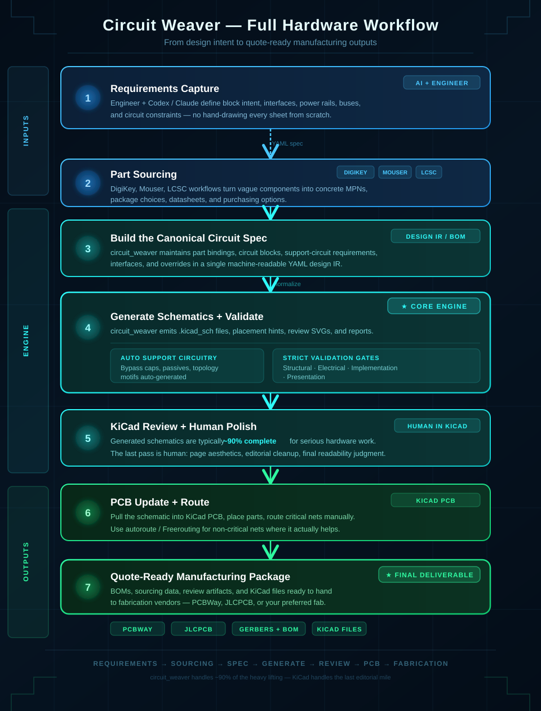

<p align="center">
  
</p>

<p align="center">
  <a href="https://github.com/mattpainter701/kicad_automations/actions/workflows/ci.yml">
    
  </a>
  
  
  
  
</p>

<p align="center">
  <strong>KiCad automation for people building real hardware.</strong><br>
  Programmatic schematic generation, strict validation, BOM + sourcing workflows, and a clean API surface<br>
  that takes you from design intent all the way to quote-ready KiCad outputs.
</p>

---

## What It Is

Circuit Weaver has two layers that work together:

| Layer | What it is | Use it for |
|---|---|---|
| **`circuit_weaver`** package | Python library + FastAPI server | Canonical design IR, transactional patching, strict validation, KiCad artifact generation |
| **`skills/`, `project-skills/`, `agents/`, `rules/`** | Workflow layer | BOM auditing, part sourcing, KiCad analysis, placement, manufacturing, AI/operator playbooks |

It is designed for:

- Engineers who want KiCad-native automation without giving up real schematic outputs
- AI/agent workflows that need a strict, machine-readable contract instead of ad hoc script chains
- Downstream hardware projects that want a reusable engine instead of maintaining a custom generator forever

---

## Why Circuit Weaver

Most hardware automation lands at one of two bad extremes:

- A pile of one-off scripts only the original author can operate
- A flashy design layer disconnected from actual KiCad deliverables

Circuit Weaver sits in the useful middle:

| Property | What it means |
|---|---|
| **Canonical spec first** | YAML / Design IR is the single source of truth |
| **KiCad-native outputs** | Generates real `.kicad_sch` files, reports, and review SVGs |
| **Strict validity gates** | Structural, electrical, implementation, and presentation checks — not just "did it export" |
| **Agent-compatible** | Patch, validate, diff, generate, and feed PCB constraints back in predictable, machine-readable flows |
| **Downstream-friendly** | The engine is generic; each hardware project owns its own design assets |

---

## How It Works

<p align="center">
  
</p>

### The flow in plain English

**1 — Requirements capture**
Start with block intent, interfaces, power rails, buses, and constraints. Codex, OpenCode, Kilo, or Claude + the engineer define the system without hand-drawing every schematic page from scratch.

**2 — Part sourcing**
The `digikey`, `mouser`, and `lcsc` workflow skills turn vague component choices into concrete MPNs, package decisions, datasheets, and purchasing options.

**3 — Build the canonical spec**
`circuit_weaver` assembles part bindings, block topology, support-circuit requirements, and all overrides into a single machine-readable YAML design IR. This is the contract everything else reads from.

**4 — Generate schematics and validate**
The engine emits `.kicad_sch` files, placement hints, review SVGs, and a design report. It also auto-generates common support passives and runs four grouped validation checks: **structural**, **electrical**, **implementation**, and **presentation**.

**5 — KiCad review + human polish**
Generated schematics are typically around **~90% complete** for serious hardware work. The last pass is still human: page aesthetics, net label readability, and the editorial judgment that is still inherently design-specific.

**6 — PCB update and route**
Pull the schematic into KiCad PCB, place parts, route critical nets manually, and use autoroute / Freerouting for non-critical nets where it actually helps.

**7 — Quote-ready package**
The result is a clean path to BOMs and outputs ready to hand to PCBWay, JLCPCB, or your preferred fabrication vendor.

---

## Quick Start

### Install

```bash
pip install -e ".[all]"
circuit-weaver --version
```

### Validate a design

```bash
circuit-weaver validate src/circuit_weaver/examples/iot_sensor.yaml
```

### Generate KiCad artifacts

```bash
circuit-weaver generate src/circuit_weaver/examples/iot_sensor.yaml --output out/iot_sensor
```

### Use the Python API

```python
from circuit_weaver.mvp import (
    validate_design,
    apply_design_patch,
    generate_artifacts,
    diff_designs,
    ingest_pcb_feedback,
)

# Validate a canonical design spec
report = validate_design(spec)

# Apply a transactional patch and re-validate
result = apply_design_patch(spec, patch)

# Generate the full KiCad artifact bundle
bundle = generate_artifacts(spec, output_dir="out/design")
```

### Run the HTTP API

```bash
uvicorn circuit_weaver.api:app --host 0.0.0.0 --port 5000
```

| Endpoint | Description |
|---|---|
| `GET /health` | Service health check |
| `GET /templates` | Available subcircuit templates |
| `POST /generate` | YAML spec → ZIP of `.kicad_sch` files + report |
| `POST /generate/from-bom` | CSV BOM upload → ZIP of schematics |
| `POST /validate` | YAML spec → validation results JSON |
| `POST /mvp/validate` | Canonical spec → grouped `mvp_strict` validation |
| `POST /mvp/generate` | Canonical spec → full KiCad artifact ZIP |
| `POST /mvp/apply-patch` | Transactional patch + re-validation |
| `POST /mvp/diff` | Semantic diff between two specs |
| `POST /mvp/pcb-feedback` | Merge PCB feedback back into the design spec |

---

## Python Package Surface

### Core transaction flow

```
spec → normalize → validate → patch → revalidate → generate KiCad artifacts
```

### Public API functions

| Function | What it does |
|---|---|
| `validate_design(spec)` | Strict grouped validation — returns a `ValidationReport` |
| `apply_design_patch(spec, patch)` | In-memory mutation with reject-on-failure |
| `generate_artifacts(spec, output_dir)` | Emits the full KiCad bundle + report |
| `diff_designs(old_spec, new_spec)` | Semantic change report between two specs |
| `ingest_pcb_feedback(spec, feedback)` | Feeds layout constraints back into the design spec |

### Validation model

`mvp_strict` checks are grouped into four categories:

| Group | Checks |
|---|---|
| `structural` | Topology, connections, hierarchy |
| `electrical` | Power, ground, net integrity |
| `implementation` | Part bindings, footprint assignments |
| `presentation` | Labels, pin numbers, sheet readability |

"The schematic generated" is not enough — the output also needs to be loadable, internally coherent, and reviewable.

---

## Repo Layout

```
kicad_automations/
├─ AGENTS.md                  # Cross-agent repo instructions
├─ opencode.json              # OpenCode/Kilo project config
├─ .agents/skills/            # Repo-local skill entrypoints for OpenCode/Kilo
├─ .opencode/agents/          # OpenCode/Kilo subagent definitions
├─ src/circuit_weaver/        # Core engine: IR, MVP, validators, exporters, helpers
│   ├─ api.py                 # FastAPI HTTP server
│   ├─ mvp.py                 # Public-facing workflow functions
│   ├─ design_ir.py           # Canonical design intermediate representation
│   ├─ generator.py           # KiCad schematic generator
│   ├─ validator.py           # Validation check runner
│   ├─ subcircuits/           # Reusable circuit template library
│   └─ helpers/               # Impedance, placement, silkscreen utilities
├─ tests/                     # Package-level regression coverage
├─ skills/                    # Global KiCad / BOM / sourcing / vendor skills
├─ project-skills/            # Project workflow templates (kicad_gen, autoroute, sim…)
├─ agents/                    # Hardware reviewer AI personas
├─ rules/                     # Repo-native KiCad workflow policy
└─ assets/                    # README visuals and branding
```

---

## Agent Platforms

Circuit Weaver now ships repo-native support for Claude Code, Codex, OpenCode, and Kilo.

| Platform | What this repo provides |
|---|---|
| Claude Code | Global/project installs via `.claude/skills` |
| Codex | Root `AGENTS.md` guidance plus global skill installs to `~/.codex/skills` |
| OpenCode | `AGENTS.md`, `opencode.json`, `.opencode/agents`, and `.agents/skills` compatibility shims |
| Kilo | Same repo assets as OpenCode; Kilo consumes the shared `opencode.json` / `.opencode` config surface |

Platform-specific install paths, naming rules, and downstream examples live in [docs/agent-platforms.md](docs/agent-platforms.md).
Installers require an explicit target selection. There is no implicit Claude-only default anymore.

---

## Workflow Skills

### Global skills (install via `./install.sh` or `./install.ps1`)

- `kicad` — schematic, PCB, and Gerber analysis
- `bom` — BOM management, auditing, and export
- `digikey`, `mouser`, `lcsc` — part sourcing and datasheet sync
- `jlcpcb`, `pcbway` — manufacturing file prep and quoting
- `ee` — general electrical engineering helpers
- `vivado` — FPGA design integration
- `design_wizard` — interactive circuit design wizard (requirements through quote-ready outputs)

### Project skill templates (install into downstream repos)

- `kicad_gen` — project-local schematic generation playbook
- `kicad_hierarchy` — hierarchical sheet management
- `kicad_validate` — project validation runner
- `kicad_pinmap` — pin mapping and netlist management
- `kicad_pcb_place` — guided part placement
- `autoroute` — Freerouting integration
- `sim` — simulation setup helpers

```bash
# Bash: install global skills for Claude, Codex, OpenCode, and Kilo
./install.sh --platform all

# PowerShell: same install on Windows
./install.ps1 -Platform all

# Install downstream project templates into the shared open-agent directory
./install.sh --project-platform agents
./install.ps1 -ProjectPlatform agents
```

OpenCode, Kilo, and `.agents/skills` targets require kebab-case skill IDs. The installers convert source template names like `kicad_gen` into installed IDs like `kicad-gen` automatically.

---

## Downstream Boundary

Keep **upstream** in `kicad_automations`:

- `circuit_weaver` package code and helpers
- Generic skills and project-skill templates
- Repo-native agents and rules

Keep **downstream** in each hardware project:

- Project wrappers like `generate_via_engine.py`
- Project-specific BOMs and pin maps
- Local symbol and footprint libraries
- Generated KiCad artifacts
- Project-local integration tests

This boundary keeps the engine generic while each hardware program owns its actual design assets.

---

## Example: Buck Converter Workflow

<details>
<summary><strong>End-to-end worked example</strong></summary>

### Analyze the schematic

```bash
python3 skills/kicad/scripts/analyze_schematic.py buck.kicad_sch --output buck_analysis.json
```

### Find missing sourcing data

```bash
python3 skills/bom/scripts/bom_manager.py analyze buck.kicad_sch --json
```

### Pull datasheets and vendor metadata

```bash
python3 skills/digikey/scripts/sync_datasheets_digikey.py buck.kicad_sch
```

### Export manufacturing BOMs

```bash
python3 skills/bom/scripts/bom_manager.py export buck.kicad_sch -o bom/bom.csv
python3 skills/bom/scripts/bom_manager.py order bom/bom.csv --boards 3 --spares 2
```

### Review PCB quality

```bash
python3 skills/kicad/scripts/analyze_pcb.py buck.kicad_pcb
```

</details>

---

## Development

```bash
# Run linting
python -m ruff check src tests

# Run tests
python -m pytest tests -q

# Install in editable mode from another repo
pip install -e /path/to/kicad_automations
```

---

## Status

**Working now**
- Standalone `circuit_weaver` package
- Full MVP API surface (`validate`, `patch`, `generate`, `diff`, `pcb-feedback`)
- FastAPI HTTP server with all endpoints
- Package-level tests and CI
- Subcircuit template library (30 templates)
- Helper extraction (placement, silkscreen, impedance)

**Active next steps**
- Continue polishing downstream package consumption
- Deepen workflow asset extraction and cleanup
- Expand acceptance fixtures beyond current example designs

---

## License

MIT. See [LICENSE](LICENSE).
