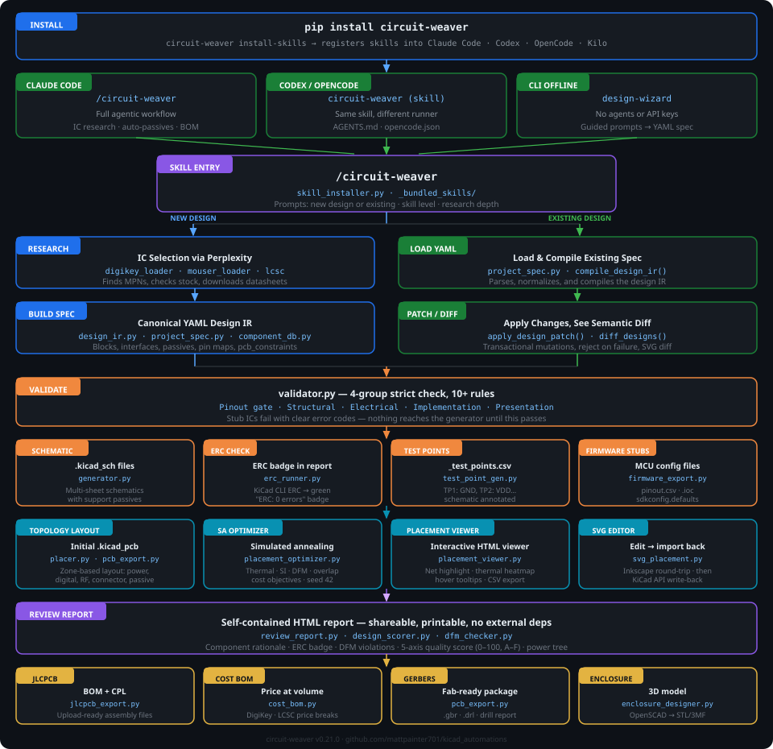

<p align="center">
  
</p>

<p align="center">
  <a href="https://github.com/mattpainter701/kicad_automations/actions/workflows/ci.yml">
    
  </a>
  <a href="https://pypi.org/project/circuit-weaver/">
    
  </a>
  
  
  
</p>

<p align="center">
  <strong>Programmatic KiCad schematic generation, strict validation, and manufacturing export<br>
  designed for AI-assisted hardware workflows — Claude Code, Codex, and offline CLI.</strong>
</p>

---

## How It Works

<p align="center">
  
</p>

Every path through Circuit Weaver follows the same contract: **describe the design → validate → generate KiCad artifacts**. The diagram above shows what each module does and which function it calls. Pick your entry point (Claude Code skill, Codex agent, or CLI wizard) and the rest is automatic.

---

## Quick Start

**Step 1 — Install**

```bash
pip install circuit-weaver
```

**Step 2 — Register the skill** *(one-time, for Claude Code / Codex / OpenCode)*

```bash
circuit-weaver install-skills
```

**Step 3 — Launch**

```bash
# In Claude Code or Codex — type the skill name:
/circuit-weaver

# Or run offline without any agent:
circuit-weaver design-wizard
```

That's it. The skill walks you through IC selection, passive generation, and manufacturing export. No YAML hand-editing required.

---

## What You Get

Every `generate` run produces a complete artifact bundle:

| Artifact | File | Description |
|-|-|-|
| KiCad schematic | `{project}.kicad_sch` | Real, loadable `.kicad_sch` — not a placeholder |
| HTML review report | `{project}_review.html` | Validation results, component rationale, DFM score, BOM |
| Test point map | `{project}_test_points.csv` | Auto-detected power, clock, bus, and differential-pair nets |
| JLCPCB BOM + CPL | `bom.csv`, `cpl.csv` | Upload-ready assembly files |
| Firmware stubs | `{project}_pinout.csv`, `.ioc`, `sdkconfig` | MCU pin map + STM32/ESP32 co-design files |
| Enclosure model | `enclosure.scad` | Parametric OpenSCAD model sized to the PCB |
| Placement SVG | `placement.svg` | Editable SVG of component placements — import back after editing in Inkscape |
| PCB file | `design.kicad_pcb` | Initial PCB with zone-based component placement |

---

## PCB Placement Workflow

Circuit Weaver has a complete placement pipeline — from automatic initial placement through optimization, interactive review, and write-back to KiCad.

### 1 — Generate initial placement

`generate` produces an initial `.kicad_pcb` with topology-aware placement (power zone, digital zone, RF zone, connector zone, passive banks) and exports a `placement.svg` for editing:

```bash
circuit-weaver generate design.yaml -o ./output
# → output/design.kicad_pcb   (zone-based initial placement)
# → output/placement.svg       (editable placement diagram)
```

### 2 — Optimize with simulated annealing

```bash
# Basic optimization (5 000 iterations, reproducible with seed)
circuit-weaver optimize-placement design.yaml --iterations 5000 --seed 42

# Thermal-aware strategy (minimizes hotspot proximity)
circuit-weaver optimize-placement design.yaml --strategy thermal --iterations 10000

# Read component thermal/SI specs from YAML files
circuit-weaver optimize-placement design.yaml --specs-dir ./specs/
```

The optimizer minimizes: overlap, boundary violations, thermal clustering, and DFM zone penalties via simulated annealing. Returns a placement JSON with x/y/rotation/layer per component.

### 3 — Review in the interactive viewer

```bash
circuit-weaver placement-viewer design.yaml -o output/viewer.html
```

Opens a self-contained HTML file with:
- Click-to-highlight nets
- Component hover tooltips (value, footprint, MPN)
- Thermal heatmap overlay (blue → red gradient by power dissipation)
- CSV export button for placement data

### 4 — Edit in Inkscape → import back

```bash
# Export editable SVG
circuit-weaver generate design.yaml --svg-placement -o ./output
# → output/placement.svg

# Edit in Inkscape (drag components, adjust positions)…

# Import edits back to .kicad_pcb and CPL
circuit-weaver import-placement output/placement.svg \
    output/design.kicad_pcb \
    output/design_updated.kicad_pcb \
    --output-cpl output/cpl_updated.csv
```

### 5 — Write directly via KiCad API

If KiCad 6+ is installed, write placements directly without SVG round-trip:

```python
from circuit_weaver import check_kicad_available, update_board_placements

if check_kicad_available():
    update_board_placements("design.kicad_pcb", placements)
```

### 6 — DFM check and panelization

```bash
# Check clearances, pad sizes, and DFM rules
circuit-weaver check-dfm design.yaml

# Get panel layout suggestions for small boards
circuit-weaver panelize design.yaml

# Export dual-sided CPL (top + bottom)
circuit-weaver export-dual-cpl design.yaml -o ./jlcpcb
```

---

## CLI Reference

```bash
# ── Design lifecycle ──────────────────────────────────────────────────────────
circuit-weaver validate design.yaml               # Validate spec (no files written)
circuit-weaver generate design.yaml -o ./output  # Full artifact bundle
circuit-weaver erc output/design.kicad_sch        # KiCad built-in ERC
circuit-weaver diff old.yaml new.yaml             # Semantic diff + optional SVG

# ── Placement ─────────────────────────────────────────────────────────────────
circuit-weaver optimize-placement design.yaml --iterations 5000 --seed 42
circuit-weaver placement-viewer design.yaml -o output/viewer.html
circuit-weaver import-placement placement.svg board.kicad_pcb out.kicad_pcb
circuit-weaver check-dfm design.yaml
circuit-weaver panelize design.yaml
circuit-weaver export-dual-cpl design.yaml -o ./jlcpcb

# ── BOM and manufacturing ─────────────────────────────────────────────────────
circuit-weaver cost-bom design.yaml --qty 1,10,100
circuit-weaver export-jlcpcb design.yaml -o ./jlcpcb
circuit-weaver export-gerbers design.yaml -o ./gerbers

# ── Design tools ──────────────────────────────────────────────────────────────
circuit-weaver scaffold --template buck --ref U1   # New spec from template
circuit-weaver list-templates --verbose             # Browse 30 subcircuit templates
circuit-weaver design-enclosure --board-width 50 --board-height 40 -o enclosure.scad
circuit-weaver harvest-specs design.yaml           # Download datasheets + extract specs
circuit-weaver fetch-spice design.yaml             # Fetch SPICE models (TI, ADI, Microchip…)
```

Run `circuit-weaver --help` or `circuit-weaver <subcommand> --help` for full flag reference.

---

## Python API

```python
from circuit_weaver.dispatcher import (
    validate_design,
    apply_design_patch,
    generate_artifacts,
    diff_designs,
    ingest_pcb_feedback,
)

# Validate a canonical design spec
report = validate_design(spec)

# Apply a transactional patch and re-validate
result = apply_design_patch(spec, patch)

# Generate the full KiCad artifact bundle
bundle = generate_artifacts(spec, output_dir="out/design")

# Semantic diff between two specs
changes = diff_designs(old_spec, new_spec)

# Feed PCB layout feedback back into the design spec
updated = ingest_pcb_feedback(spec, pcb_feedback)
```

### Validation groups

`validate_design` runs four grouped checks and returns a structured `ValidationReport`:

| Group | What it checks |
|-|-|
| `structural` | Topology, block connections, hierarchy integrity |
| `electrical` | Power rails, ground nets, net continuity |
| `implementation` | Part bindings, footprint assignments, pinout verification |
| `presentation` | Labels, pin numbers, sheet readability |

### HTTP API

```bash
uvicorn circuit_weaver.api:app --host 0.0.0.0 --port 5000
```

| Endpoint | Method | Description |
|-|-|-|
| `/health` | GET | Service health |
| `/templates` | GET | Available subcircuit templates |
| `/generate` | POST | YAML spec → ZIP of `.kicad_sch` + report |
| `/validate` | POST | YAML spec → validation JSON |
| `/mvp/apply-patch` | POST | Transactional patch + re-validation |
| `/mvp/diff` | POST | Semantic diff between two specs |
| `/mvp/pcb-feedback` | POST | Merge PCB layout feedback into spec |

---

## What's New in v0.21.0

| Sprint | Feature |
|-|-|
| 25 | **Component Selection Rationale** — HTML review report now includes a per-IC table showing why each part was chosen, key electrical specs, and any reference design cited |
| 25 | **Auto Test Point Generation** — `generate_artifacts()` emits `{project}_test_points.csv` and annotates the schematic with TP labels; detects power, ground, clock, bus, and differential-pair nets |
| 24 | **Firmware Co-Design Export** — Auto-generates `{project}_pinout.csv`, STM32 `.ioc` skeleton, and ESP32 `sdkconfig.defaults` when MCU blocks are present |
| 23 | **KiCad CLI ERC Integration** — `circuit-weaver erc` runs KiCad's built-in ERC and surfaces results in the HTML report with a pass/fail badge |
| 22 | **Pinout Verification Gate** — ICs using unverified stub pinouts now fail validation before any schematic is emitted |

---

## Repo Layout

```
kicad_automations/
├── src/circuit_weaver/      # Core engine
│   ├── dispatcher.py           # Public API: validate, patch, generate, diff, pcb-feedback
│   ├── design_ir.py            # Canonical design intermediate representation (DesignIR)
│   ├── generator.py            # .kicad_sch file emitter
│   ├── validator.py            # Four-group validation pipeline
│   ├── review_report.py        # HTML review report generator
│   ├── test_point_gen.py       # Auto test-point classification and CSV export
│   ├── firmware_export.py      # MCU co-design stubs (pinout CSV, .ioc, sdkconfig)
│   ├── placer.py               # Topology-aware schematic placement engine
│   ├── placement_optimizer.py  # Simulated annealing PCB placement optimizer
│   ├── placement_viewer.py     # Interactive HTML viewer (net highlight, thermal heatmap)
│   ├── svg_placement.py        # Bidirectional SVG placement editor (export + import)
│   ├── kicad_placement_api.py  # KiCad 6+ pcbnew API integration
│   ├── pcb_export.py           # Initial .kicad_pcb generation with zone-based layout
│   ├── sourcing_auditor.py     # BOM sourcing audit
│   ├── design_scorer.py        # Electrical quality score (0–100, A–F)
│   ├── dfm_checker.py          # DFM rule checks
│   ├── api.py                  # FastAPI HTTP server
│   ├── helpers/placement.py    # KiCad API abstraction, footprint matching utilities
│   └── subcircuits/            # Reusable circuit template library (30 templates)
├── tests/                   # Regression test suite (430+ tests)
├── skills/                  # Global workflow skills: kicad, bom, digikey, lcsc, ee…
├── project-skills/          # Per-project templates: kicad_gen, autoroute, sim…
├── agents/                  # Hardware reviewer AI agent definitions
├── rules/                   # KiCad workflow policy files
├── samples/                 # Sample designs (iot_sensor_node, zigbee_humidistat…)
└── assets/                  # README visuals: banner, workflow diagram
```

---

## Agent Platform Support

| Platform | What's included |
|-|-|
| **Claude Code** | `/circuit-weaver` global skill via `install-skills` |
| **Codex** | `AGENTS.md` guidance + global `~/.codex/skills` install |
| **OpenCode / Kilo** | `opencode.json`, `.opencode/agents/`, `.agents/skills/` shims |

Install for all platforms at once:

```bash
# Bash (Mac/Linux/WSL)
./install.sh --platform all

# PowerShell (Windows)
./install.ps1 -Platform all
```

---

## Sample Design

Try the full workflow on a built-in sample:

```bash
# Validate
circuit-weaver validate samples/iot_sensor_node/iot_sensor_node.yaml

# Generate schematic + report + test points + firmware stubs
circuit-weaver generate samples/iot_sensor_node/iot_sensor_node.yaml -o ./output

# Export JLCPCB BOM + CPL
circuit-weaver export-jlcpcb samples/iot_sensor_node/iot_sensor_node.yaml -o ./output/jlcpcb
```

---

## Contributing

```bash
# Install with dev dependencies
pip install -e ".[dev]"

# Install pre-commit hooks
pre-commit install

# Lint
python -m ruff check src tests

# Test
python -m pytest tests -q
```

Pre-commit hooks run ruff, YAML validation, and `circuit-weaver validate --strict` on changed design specs automatically.

---

## License

MIT. See [LICENSE](LICENSE).
