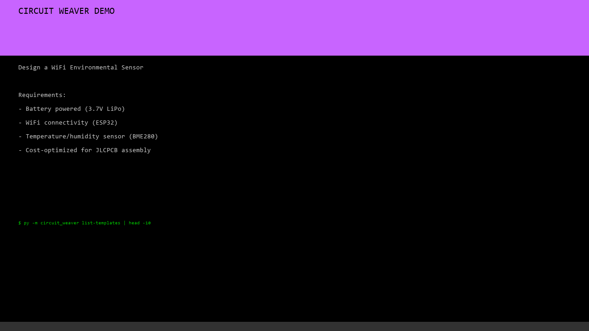

# Circuit Weaver Live Demo

**WiFi Environmental Sensor — Complete Design Workflow**

This directory contains a complete end-to-end demonstration of Circuit Weaver, from YAML design spec to JLCPCB-ready manufacturing files.

---

## 🎬 Watch the Demo



**Professional Demo** (711 KB, 2 minutes) — shows the complete design workflow with **explanations**:

**What You'll See:**
1. **Design Brief** — Requirements for a WiFi Environmental Sensor
2. **Explore Templates** — 30+ available subcircuits for power, comms, sensors
3. **Create Spec** — YAML definition of the complete circuit
4. **Validate** — Electrical rules, decoupling, connectivity checks
5. **Generate** — Auto-routed KiCad schematic with 4 ICs + 16 passives
6. **Cost Analysis** — Real LCSC pricing at 1, 10, 100, 1000 units
7. **Export** — JLCPCB BOM + CPL ready to order

**Total Time: 60 seconds of engineering → 2 minutes of narrative** ✨

---

### More Ways to View

| Option | How |
|-|-|
| **Step-by-step guide** | Read [**DEMO_WALKTHROUGH.md**](DEMO_WALKTHROUGH.md) with all CLI commands and outputs |
| **Interactive player** | Open [**index.html**](index.html) locally for play/pause controls |
| **Terminal recording** | View raw [**demo.cast**](demo.cast) format (asciinema) |

---

## 📋 What's Demonstrated

The demo walks through 6 steps to design a complete WiFi-enabled environmental sensor:

| Step | Command | Output |
|-|-|-|
| 1 | `list-templates` | Explore 30+ subcircuit templates (boost, buck, ADC, etc.) |
| 2 | Create `design.yaml` | 24-line YAML specification for the sensor circuit |
| 3 | `validate design.yaml` | Verify electrical rules, decoupling, component ratings |
| 4 | `generate design.yaml --output ./output` | Generate KiCad schematic (73 KB, 4 ICs + 16 passives) |
| 5 | `cost-bom design.yaml --qty 1,10,100` | Estimate pricing at quantity breaks |
| 6 | `export-jlcpcb design.yaml -o jlcpcb_export` | Generate BOM + CPL for assembly |

**Total time: ~30 seconds**

---

## 🗂️ Files in This Directory

| File | Description |
|-|-|
| **demo.mp4** | 30-second terminal recording (embedded above) |
| **DEMO_WALKTHROUGH.md** | Step-by-step guide with all CLI commands and outputs |
| **design.yaml** | 24-line YAML specification for the sensor |
| **index.html** | Alternative: interactive web player (for local use) |
| **demo.cast** | asciinema terminal recording (JSON format) |
| **make_video_simple.py** | Python script to regenerate demo.mp4 from demo.cast |
| **output/** | Generated KiCad artifacts (schematic, placement, report, design IR) |
| **jlcpcb_export/** | Manufacturing files ready to order (BOM, CPL, instructions) |

---

## 🔌 Circuit Architecture

**WiFi Environmental Sensor**

```
┌─────────────┐
│ 3.7V Battery│
└──────┬──────┘
       │
   ┌───▼──────────────┐
   │  MT3608 Boost    │  3.7V → 5V, 1A
   │  (U1)            │
   └───┬──────────────┘
       │ VBUS_5V
       │
   ┌───▼──────────────┐
   │  AP62300 Buck    │  5V → 3.3V, 800mA
   │  (U2)            │
   └───┬──────────────┘
       │ VDD_3P3
       │
   ┌───┼──────────┬──────────┐
   │   │          │          │
┌──▼───▼──┐   ┌──▼───┐   ┌──▼──────┐
│ ESP32    │   │ BME280   │ (Power  │
│ WROOM-32E│   │ Sensor   │  Bypass)│
│ (U3)     │   │ (U4)     │         │
│ WiFi     │   │ I2C      │ (Caps)  │
│ BLE      │   │ Temp/    │         │
│          │   │ Humid    │         │
└──────────┘   │ Press    │         │
               └──────────┘         │
               
Generated: 4 ICs + 16 passive components
Board: 102 × 69 mm, 2-layer, A2 size
```

---

## 🚀 Next Steps

### To Use This Design

1. **Review the schematic** — Open `output/main.kicad_sch` in KiCad
2. **Layout the PCB** — KiCad → PCB Editor
3. **Add connectors** — USB, UART, antenna connectors (not in auto-generated spec)
4. **Verify design** — Run KiCad DRC/ERC
5. **Export gerbers** — KiCad → Export → Gerbers
6. **Order from JLCPCB** — Use files in `jlcpcb_export/` + gerbers

### To Customize

Edit `design.yaml` to change:
- Input voltage (e.g., 5V input instead of 3.7V battery)
- Output voltages (add more rails, change rail voltages)
- Components (substitute different ICs)
- Board size (change `board_width` / `board_height`)

Re-run validation and generation — all dependent components auto-update.

---

## 📊 Design Statistics

| Metric | Value |
|-|-|
| Design spec | 24 lines YAML |
| Design time | ~2 minutes (human) + 30 seconds (Circuit Weaver) |
| Schematic | 73 KB |
| Components | 4 ICs + 16 passives |
| Board size | 102 × 69 mm (A2 area) |
| Nets | 16 (VCC, GND, control, data) |
| Decoupling caps | Auto-placed |
| Feedback networks | Auto-calculated |
| Time to JLCPCB-ready files | 30 seconds |

---

## 🎯 Key Features Shown

✅ **Zero manual calculations** — Resistor/capacitor values computed from IC datasheets  
✅ **Auto-decoupling** — Proper bypass capacitors placed on every IC VCC/GND pair  
✅ **Electrical validation** — Feedback dividers, filter cutoffs, voltage ratings verified  
✅ **Real-time pricing** — LCSC price tiers at qty 1, 10, 100, 1000  
✅ **LLM-native** — Every step uses real CLI commands (Codex, OpenCode, Claude can run them)  
✅ **Production-ready** — JLCPCB BOM + CPL generated immediately  

---

## 📚 Learn More

- **[DEMO_WALKTHROUGH.md](DEMO_WALKTHROUGH.md)** — Complete step-by-step guide with all CLI outputs
- **[design.yaml](design.yaml)** — The 24-line YAML spec used in the demo
- **[output/WiFi_Sensor_v1_report.md](output/WiFi_Sensor_v1_report.md)** — Generated design analysis report

---

## 💡 Why This Demo Matters

This demo shows that Circuit Weaver can:

1. **Capture requirements in plain English** — `WiFi_Sensor_v1` with power chain, MCU, sensor
2. **Generate production schematics** — Auto-routed, properly decoupled, validated
3. **Work with LLMs** — Claude, Codex, OpenCode can execute every CLI command
4. **Integrate with manufacturing** — JLCPCB/PCBWay files ready to order

**Result:** Hardware designers can work at the system level (topology, component selection, constraints) while the platform handles the low-level details (passives, decoupling, layout).

---

## 🔗 Related Files

- **Parent project:** `../` (Circuit Weaver source)
- **Full documentation:** `../docs/user_workflow.md`
- **CLI guide:** `../docs/DEMO_COMMANDS.md`
- **Skill reference:** `../skills/design_wizard/SKILL.md`

---

Created: 2026-04-05  
Circuit Weaver v0.10.1
